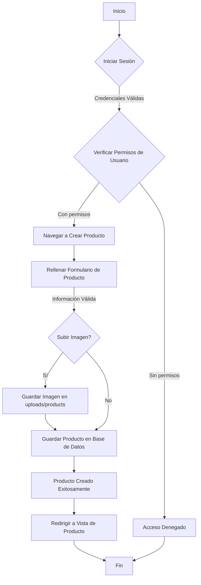
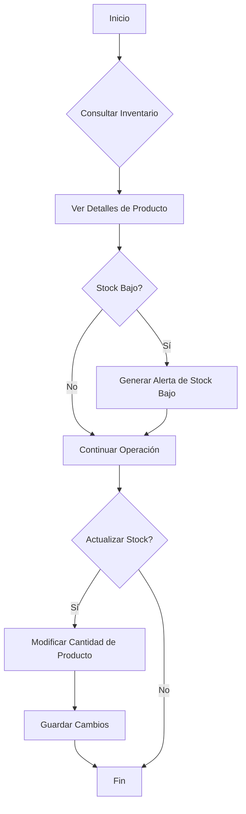
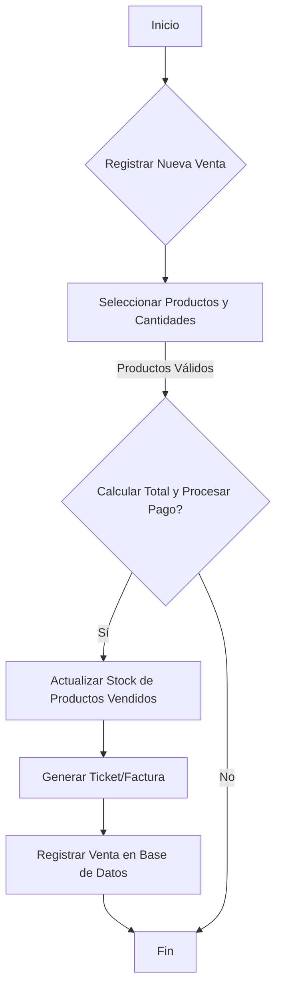
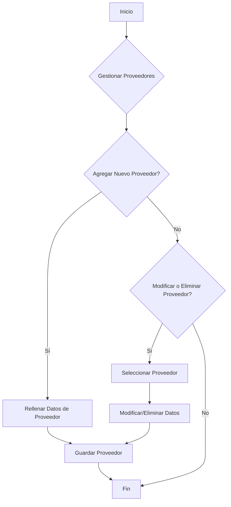
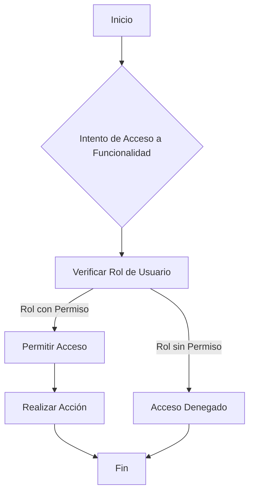
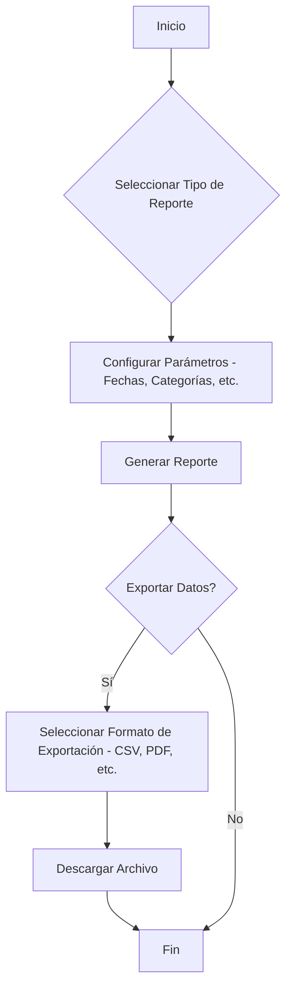
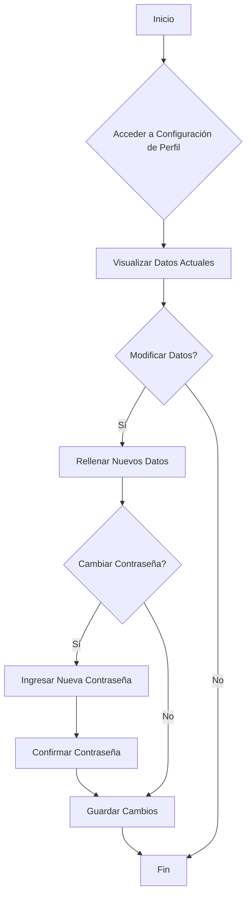

# Sistema de Gestión de Inventario para Abarrotes Tendejosn San Francisco

<div align="center">
  
</div>

Este es un sistema de gestión de inventario robusto y fácil de usar, diseñado específicamente para optimizar las operaciones diarias de la tienda de abarrotes "Tendejosn San Francisco". Facilita la automatización de procesos clave, desde la gestión de productos hasta el control de stock y ventas.

## 🌟 Características Principales

*   **Gestión Integral de Productos**: Controla cada aspecto de tus productos, incluyendo nombre, código, descripción, precios (venta y costo), stock actual y mínimo, categoría, proveedor, unidad de medida, ubicación en almacén e imágenes.
*   **Control de Stock Avanzado**: Monitorea los niveles de inventario en tiempo real, genera alertas automáticas para stock bajo y optimiza el manejo de tus productos.
*   **Gestión de Proveedores**: Mantén un registro detallado de tus proveedores y su relación con los productos.
*   **Sistema de Ventas Eficiente**: Registra ventas de manera ágil, actualizando automáticamente el inventario.
*   **Seguridad y Roles de Usuario**: Implementa un sistema de control de acceso basado en roles para una gestión segura y diferenciada de permisos.
*   **Reportes y Análisis**: Accede a informes detallados sobre inventario, ventas y tendencias para una toma de decisiones informada.

## 🛠️ Tecnologías Utilizadas

*   **Backend**:
    *   PHP (Lenguaje de Programación)
    *   Yii2 Framework
    *   MySQL (Base de Datos)
*   **Frontend**:
    *   Next.js (Marco de React)
    *   Tailwind CSS (Para estilos modernos y responsivos)
    *   Radix UI (Componentes de UI sin estilo)
    *   Lucide React (Iconos)
*   **Otras Herramientas**:
    *   Git (Control de Versiones)
    *   Composer (Gestor de dependencias de PHP)
    *   npm / pnpm (Gestor de paquetes de Node.js)
    *   Vercel (Potencial despliegue del frontend)

## 🚀 Diagramas de Flujo del Sistema

A continuación se presentan los principales procesos y flujos de trabajo del sistema de gestión de inventario:

### 📝 Proceso de Creación de un Producto



### 📦 Proceso de Gestión de Inventario y Stock



### 🛒 Proceso de Gestión de Ventas



### 🚚 Proceso de Gestión de Proveedores



### 🔒 Control de Acceso y Permisos



### 📊 Generación de Reportes y Exportación de Datos



### 👤 Proceso de Configuración de Perfil



## ⚙️ Instalación y Configuración

Para poner en marcha el proyecto, sigue estos pasos:

1.  **Clonar el Repositorio**:
    ```bash
    git clone https://github.com/JosiasDenis12/abarrotes_inventory.git
    cd abarrotes_inventory
    ```

2.  **Configurar el Backend (PHP/Yii2)**:
    *   Asegúrate de tener un servidor web (Apache/Nginx) con PHP y MySQL.
    *   Crea una base de datos MySQL y configura los detalles en `config/db.php`.
    *   Instala las dependencias de Composer:
        ```bash
        composer install
        ```
    *   Ejecuta las migraciones de la base de datos (si existen).

3.  **Configurar el Frontend (Next.js)**:
    *   Instala las dependencias de Node.js:
        ```bash
        npm install # o pnpm install
        ```
    *   Configura la URL de tu backend PHP en las variables de entorno de Next.js.
    *   Inicia el servidor de desarrollo:
        ```bash
        npm run dev
        ```

## 🤝 Contribuciones

¡Las contribuciones son bienvenidas! Si deseas contribuir, por favor, sigue estos pasos:

1.  Haz un "fork" del repositorio.
2.  Crea una nueva rama (`git checkout -b feature/nueva-caracteristica`).
3.  Realiza tus cambios y haz "commit" (`git commit -m 'feat: agrega nueva caracteristica'`).
4.  Sube tu rama (`git push origin feature/nueva-caracteristica`).
5.  Abre un "Pull Request".

## 📄 Licencia

Este proyecto está bajo la Licencia MIT. Consulta el archivo `LICENSE` para más detalles.